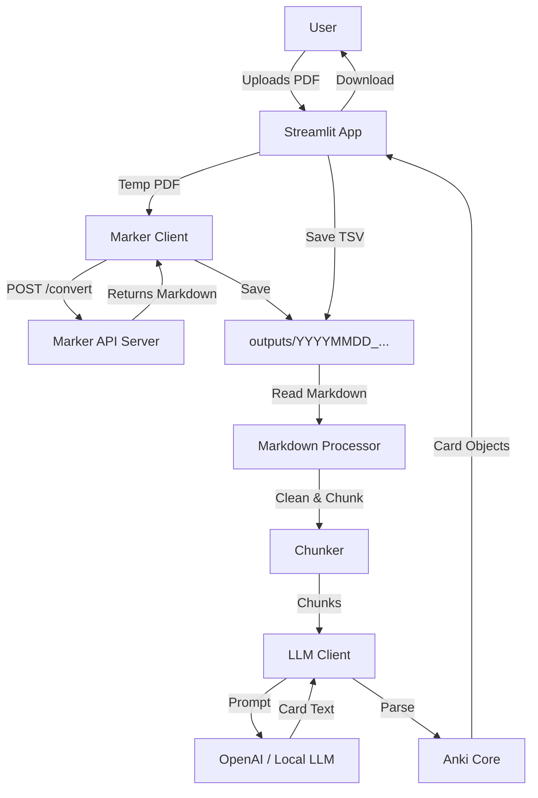

# Data Flow and Storage in PDF2Anki

## 1. Overview

PDF2Anki transforms PDF documents into Anki flashcards through a multi-step process involving PDF-to-Markdown conversion, intelligent text chunking, and LLM-based card generation. This document outlines how data moves through the system and where it is stored.

## 2. Data Flow Architecture

The system operates in a linear pipeline:

## 3. Data Processing Steps

### 3.1. Input Handling
- **User Interface:** Streamlit (`src/streamlit_app.py`) provides the frontend.
- **File Upload:** Users upload PDF files via the browser.
- **Temporary Storage:** Uploaded files are saved to a temporary system directory (`tempfile.NamedTemporaryFile`) for processing.
- **Duplicate Detection:** A SHA256 hash of the PDF content is calculated to prevent redundant conversions.

### 3.2. PDF to Markdown Conversion
- **Client:** `src/marker_client.py` handles the communication.
- **Service:** A local `marker-api` server (default: `http://localhost:8000`) processes the PDF.
- **Mechanism:** The PDF is sent via a POST request.
- **Result:** The API returns the converted Markdown text and extracted metadata.
- **Images:** Images are currently handled by the Marker API (embedded or extracted), though the Streamlit app focuses on text.

### 3.3. Markdown Processing
- **Cleaning:** `src/markdown_cleaner.py` removes unnecessary artifacts.
- **Chunking:** `src/markdown_chunker.py` splits the text into semantic chunks (based on token limits, e.g., 2000 tokens) to fit LLM context windows.
- **Semantics:** `src/semantic_detector.py` identifies key terms and definitions to enhance the context provided to the LLM.

### 3.4. Card Generation
- **Prompting:** `src/anki_core.py` constructs prompts for the LLM, specifying the output format (basic or cloze).
- **LLM Interaction:** The system sends chunks to an OpenAI-compatible API (e.g., OpenAI GPT-4o, or a local model like Llama 3 via vLLM/llama.cpp).
- **Parsing:** The LLM's text response is parsed back into structured `Card` objects.

## 4. Data Storage

All persistent data is stored in the `outputs/` directory.

### 4.1. Directory Structure
For each conversion session, a new directory is created:
`outputs/YYYYMMDD_HHMMSS_{filename_stem}/`

### 4.2. Stored Files
| File | Description | Format |
|------|-------------|--------|
| `converted.md` | The raw Markdown text converted from the PDF. | Markdown (UTF-8) |
| `meta.json` | Metadata including source path, SHA256 hash, API URL, and status. | JSON |
| `anki_cards.tsv` | The generated Anki cards, ready for import. | TSV (Tab-Separated) |
| `prompt_script.sh`| A reproducible Bash script to regenerate cards using CLI tools. | Bash Script |

### 4.3. Intermediate Cache
- `marker-api` caches conversions in `outputs/conversions/{sha256}/` to avoid re-processing the exact same file content.

## 5. Data Security & Privacy

- **Local Processing:** The PDF conversion happens locally via `marker-api`. No PDF content is sent to external cloud services for *conversion*.
- **LLM Privacy:**
    - If using **OpenAI**, text chunks are sent to OpenAI's servers.
    - If using a **Local LLM** (e.g., via `LLM_API_BASE`), data remains entirely on your local network/machine.
- **Cleanup:** Temporary files created during upload are deleted after processing.

