# **Back Propagation**

**Full-Stack LLMs, 2025 Fall** 

#### **Training neural nets through empirical risk minimization: problem setup**

• Given a training set of input−output pairs

$$(X_1, d_1), (X_2, d_2), \dots, (X_T, d_T)$$

• The divergence on the ith instance is

$$-Y_i = f(X_i; W)$$

• The loss (empirical risk)

$$Loss(W) = \frac{1}{T} \sum_{i} div(Y_i, d_i)$$

• Minimize w.r.t using gradient descent

#### **Notation**

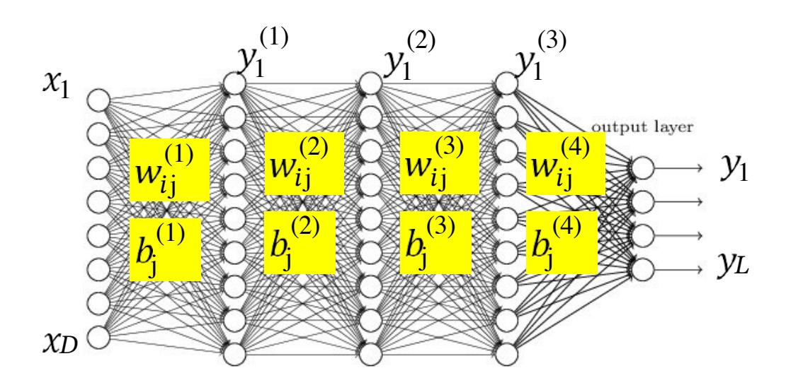

- The input layer is the Oth layer
- We will represent the output of the i–th perceptron of the kth layer as  $y_i^{(k)}$ 
  - Input to network:  $y_i^{(0)} = x_i$
  - Output of network:  $y_i = y_i^{(N)}$
- We will represent the weight of the connection between the i–th unit of the k–1th layer and the jth unit of the k–th layer as  $w_{i\,\rm i}^{~(k)}$ 
  - $-\,\,$  The bias to the jth unit of the k–th layer is  $\,b_{
    m j}^{\,(k)}$

#### **Recap: Gradient Descent Algorithm**

- Initialize: To minimize any function Loss(W) w.r.t W
  - $-W_0$
  - -k = 0
- do
  - $-W^{k+1} = W^k \eta^k \nabla Loss(W^k)^T$
  - -k = k + 1
- while  $|Loss(W^k) Loss(W^{k-1})| > \varepsilon$

## **Recap: Gradient Descent Algorithm**

- In order to minimize w.r.t.
- Initialize:
  - –
  - –
- do
  - For every component

• 
$$W_i^{k+1} = W_i^k - \eta^k \frac{\partial L}{\partial W_i}$$

Explicitly stating it by component

$$-k = k + 1$$

• while 
$$|L(W^k) - L(W^{k-1})| > \varepsilon$$

#### **Training Neural Nets through Gradient Descent**

#### **Totaltraining Loss:**

$$Loss = \frac{1}{T} \sum_{t} Div(Y_t, d_t)$$

- Gradient descent algorithm:
- Initialize all weights and biases

Assuming the bias is also represented as a weight

- Using the extended notation: the bias is also a weight
- Do:

• 
$$w_{i,j}^{(k)} = w_{i,j}^{(k)} - \eta \frac{dLoss}{dw_{i,j}^{(k)}}$$

• Until has converged

#### **Training Neural Nets through Gradient Descent**

#### **Totaltraining Loss:**

$$Loss = \frac{1}{T} \sum_{t} Div(Y_t, d_t)$$

- Gradient descent algorithm:
- Initialize all weights and biases

Assuming the bias is also represented as a weight

- Using the extended notation: the bias is also a weight
- Do:

• 
$$w_{i,j}^{(k)} = w_{i,j}^{(k)} - \eta \frac{dLoss}{dw_{i,j}^{(k)}}$$

• Until has converged

## **The derivative**

#### **Totaltraining Loss:**

$$Loss = \frac{1}{T} \sum_{t} Div(Y_t, d_t)$$

• Computing the derivative

#### **Total derivative:**

$$\frac{dLoss}{dw_{i,j}^{(k)}} = \frac{1}{T} \sum_{t} \frac{dDiv(Y_t, d_t)}{dw_{i,j}^{(k)}}$$

## **The derivative**

#### **Totaltraining Loss:**

$$Loss = \frac{1}{T} \sum_{t} Div(Y_t, d_t)$$

• Computing the derivative

# **Total derivative:**

• So we must first figure out how to compute the derivative of divergences of individual training inputs

For any differentiable function

$$y = f(x)$$

with derivative

$$\frac{dy}{dx}$$

the following must hold for sufficiently small

$$\Delta x \longrightarrow \Delta y \approx \frac{dy}{dx} \Delta x$$

For any differentiable function

$$y = f(x)$$

with derivative

$$\frac{dy}{dx}$$

the following must hold for sufficiently small

$$\Delta x \longrightarrow \Delta y \approx \frac{dy}{dx} \Delta x$$

Introducing the "influence" diagram: x influences y

For any differentiable function

$$y = f(x)$$

with derivative

$$\frac{dy}{dx}$$

the following must hold for sufficiently small

$$\Delta x \longrightarrow \Delta y \approx \frac{dy}{dx} \Delta x$$

Introducing the "influence" diagram: x influences y

The derivative graph: The edge carries the derivative.

Node and edge weights multiply

For any differentiable function

$$y = f(x_1, x_2, \dots, x_M)$$

What is the influence diagram relating 1 2 and ?

For any differentiable function

$$y = f(x_1, x_2, \dots, x_M)$$

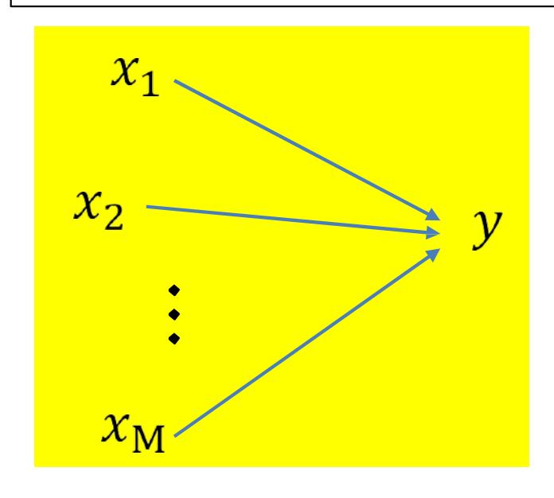

The derivative diagram?

For any differentiable function

$$y = f(x_1, x_2, \dots, x_M)$$

with partial derivatives

$$\frac{\partial y}{\partial x_1}$$
,  $\frac{\partial y}{\partial x_2}$ , ...,  $\frac{\partial y}{\partial x_M}$ 

For any differentiable function

$$y = f(x_1, x_2, \dots, x_M)$$

with partial derivatives

$$\frac{\partial y}{\partial x_1}$$
,  $\frac{\partial y}{\partial x_2}$ , ...,  $\frac{\partial y}{\partial x_M}$ 

the following must hold for sufficiently small 1 2

$$\Delta x_1, \Delta x_2, \dots, \Delta x_M$$

$$\Delta y \approx \frac{\partial y}{\partial x_1} \Delta x_1 + \frac{\partial y}{\partial x_2} \Delta x_2 + \dots + \frac{\partial y}{\partial x_M} \Delta x_M$$

## **Calculus Refresher: Chain rule**

For any nested function

$$x \longrightarrow g \longrightarrow y$$

## **Calculus Refresher: Chain rule**

For any nested function

$$\frac{dy}{dx} = \frac{dy}{dg(x)} \frac{dg(x)}{dx}$$

$$x \longrightarrow g \longrightarrow y$$

$$\Delta x \xrightarrow{\frac{dg}{dx}} \Delta g \xrightarrow{\frac{dy}{dg}} \Delta y$$

$$\Delta y = \frac{dy}{dg(x)} \frac{dg(x)}{dx} \Delta x$$

## **Distributed Chain Rule: Influence Diagram**

$$y = f(g_1(x), g_2(x), ..., g_M(x))$$

Shorthand:

## **Distributed Chain Rule: Influence Diagram**

• affects through each of

## **Distributed Chain Rule: Influence Diagram**

$$y = f(g_1(x), g_1(x), ..., g_M(x))$$

## **Calculus Refresher: Chain rule summary**

For 
$$y = f(z_1, z_2, ..., z_M)$$
  
where  $z_i = g_i(x)$ 

$$\Delta y = \sum_{i} \frac{\partial y}{\partial z_{i}} \Delta z_{i} \quad \Delta z_{i} = \frac{dz_{i}}{dx} \Delta x$$

$$\frac{dy}{dx} = \frac{\partial y}{\partial z_1} \frac{dz_1}{dx} + \frac{\partial y}{\partial z_2} \frac{dz_2}{dx} + \dots + \frac{\partial y}{\partial z_M} \frac{dz_M}{dx}$$

## **Calculus Refresher: Chain rule summary**

$$l = f(y)$$

$$y = g(z)$$

$$\frac{dl}{dz} = \frac{dl}{dy} \frac{dy}{dz}$$

For 
$$l = f(z_1, z_2, ..., z_M)$$
  
where  $z_i = g_i(x)$ 

$$\frac{dl}{dx} = \frac{\partial l}{\partial z_1} \frac{dz_1}{dx} + \frac{\partial l}{\partial z_2} \frac{dz_2}{dx} + \dots + \frac{\partial l}{\partial z_M} \frac{dz_M}{dx}$$

## **Our problem for today**

• How to compute instance for a single data

## **A first closer look at the network**

- Showing a tiny 2−input network for illustration
  - Actual network would have many more neurons and inputs

## **A first closer look at the network**

- Showing a tiny 2−input network for illustration
  - Actual network would have many more neurons and inputs
- Explicitly separating the affine function of inputs from the activation

#### A first closer look at the network

- Showing a tiny 2-input network for illustration
  - Actual network would have many more neurons and inputs
- Expanded with all weights shown
- Let's label the other variables too...

#### Computing the derivative for a single input

## Computing the derivative for a single input

## **Computing the gradient**

• Note: computation of the derivative requires intermediate and final output values of the network in response to the input

We will refer to the process of computing the output from an input as the forward pass

We will illustrate the forward pass in the following slides

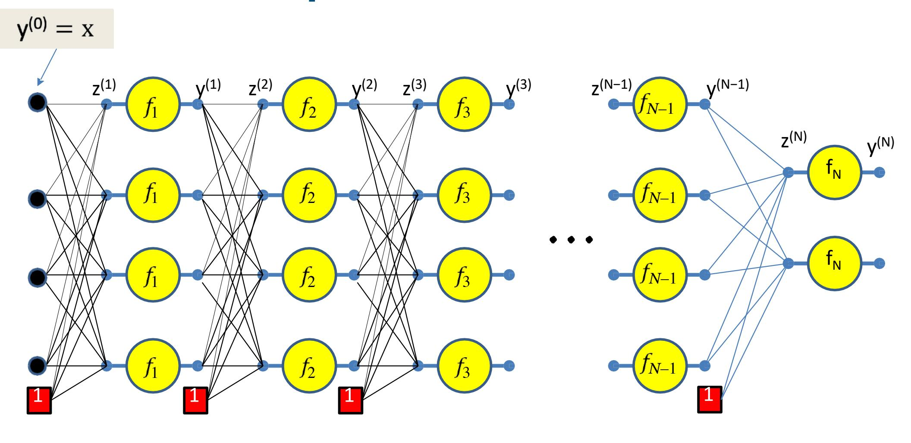

$$y^{(0)} = x$$

$$z_1^{(1)} = \sum_i w_{i1}^{(1)} y_i^{(0)}$$

$$z_j^{(1)} = \sum_i w_{ij}^{(1)} y_i^{(0)}$$

$$z_j^{(1)} = \sum_i w_{ij}^{(1)} y_i^{(0)} \quad y_j^{(1)} = f_1$$

$$y_j^{(1)} = f_1\left(z_j^{(1)}\right)$$

$$z_{j}^{(1)} = \sum_{i} w_{ij}^{(1)} y_{i}^{(0)} \quad y_{j}^{(1)} = f_{1} \left( z_{j}^{(1)} \right) \quad z_{j}^{(2)} = \sum_{i} w_{ij}^{(2)} y_{i}^{(1)} \quad y_{j}^{(2)} = f_{2} \left( z_{j}^{(2)} \right)$$

$$z_j^{(3)} = \sum_i w_{ij}^{(3)} y_i^{(2)}$$

$$z_j^{(1)} = \sum_i w_{ij}^{(1)} y_i^{(0)} \quad y_j^{(1)} = f_1 \left( z_j^{(1)} \right) \quad z_j^{(2)} = \sum_i w_{ij}^{(2)} y_i^{(1)} \quad y_j^{(2)} = f_2 \left( z_j^{(2)} \right)$$

$$z_j^{(1)} = \sum_{i} w_{ij}^{(1)} y_i^{(0)} \quad y_j^{(1)} = f_1 \left( z_j^{(1)} \right) \quad z_j^{(2)} = \sum_{i} w_{ij}^{(2)} y_i^{(1)} \quad y_j^{(2)} = f_2 \left( z_j^{(2)} \right)$$

$$z_j^{(3)} = \sum_i w_{ij}^{(3)} y_i^{(2)} \qquad y_j^{(3)} = f_3 \left( z_j^{(3)} \right) \qquad \bullet \quad \bullet$$

$$y^{(0)} = x$$

$$y_j^{(N-1)} = f_{N-1} \left( z_j^{(N-1)} \right) \quad z_j^{(N)} - \sum_i w_{ij}^{(N)} y_i^{(N-1)}$$

$$\mathbf{y}^{(N)} = f_N(\mathbf{z}^{(N)})$$

## **Forward Computation**

$$y^{(0)} = x$$

ITERATE FOR k = 1:N for j = 1:layer-width

$$y_i^{(0)} = x_i$$

$$z_j^{(k)} = \sum_i w_{ij}^{(k)} y_i^{(k-1)}$$

$$y_j^{(k)} = f_k \left( z_j^{(k)} \right)$$

## **Forward "Pass"**

- Input: dimensional vector
- Set:
  - , isthe width of the 0th (input) layer

$$-y_j^{(0)} = x_j, \ j = 1 \dots D; \qquad y_0^{(k=1\dots N)} = x_0 = 1$$

• 
$$z_j^{(k)} = \sum_{i=0}^{D_{k-1}} w_{i,j}^{(k)} y_i^{(k-1)}$$

• 
$$y_j^{(k)} = f_k \left( z_j^{(k)} \right)$$

• Output:

$$-Y = y_j^{(N)}, j = 1...D_N$$

We have computed all these intermediate values in the forward computation

We must remember them - we will need them to compute the derivatives

First, we compute the divergence between the output of the net y = y(N) and the desired output

We then compute network y(N) Y( ) the derivative of the divergence w.r.t. the final output of the

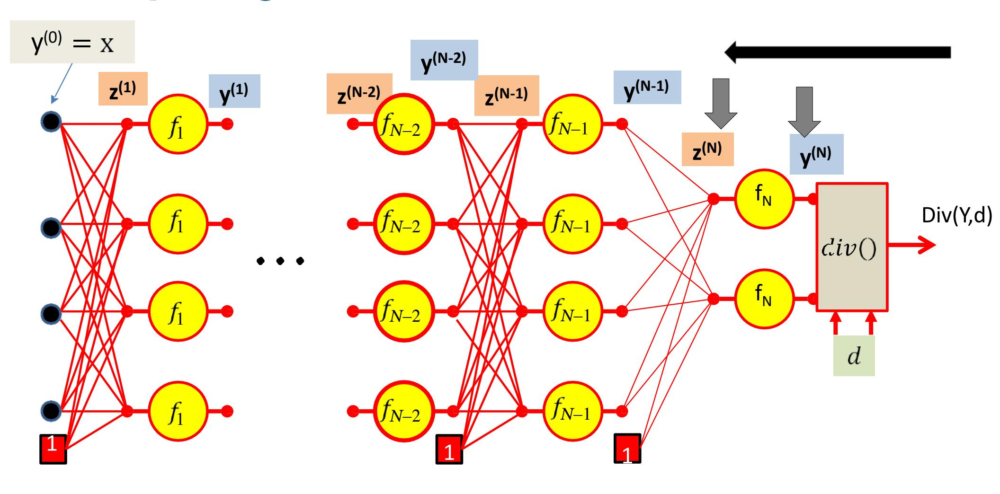

We then compute network y(N) Y( ) the derivative of the divergence w.r.t. the final output of the

We ( ) then compute the derivative of the divergence w.r.t. the *pre−activation* affine combination z(N) using the chain rule

( ) Continuing on, we will compute the derivative of the divergence with respect to the weights of the connections to the output layer

Continuing on, we will ( ) compute the derivative of the divergence with respect to the weights of the connections to the output layer

Then continue with the chain rule to compute divergence w.r.t. the output of the N−1th layer Y( −1) the derivative of the

$$\Gamma_{z^{(N-1)}} div(.)$$

$$\nabla_{W^{(N-1)}} div(.)$$

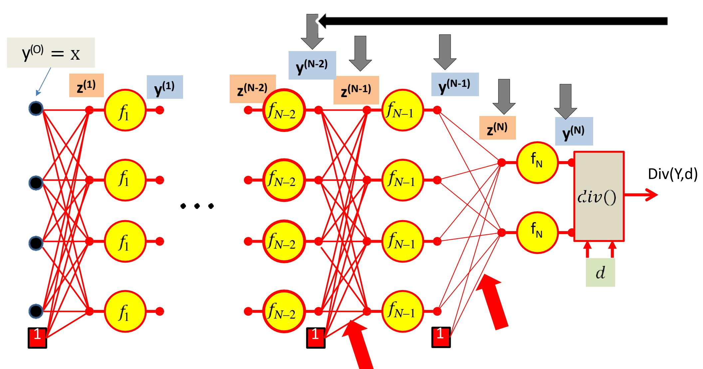

$$\Gamma_{Y^{(N-2)}} div(.)$$

$$\Gamma_{z^{(N-2)}} div(.)$$

$$\Gamma_{Y^{(1)}} div(.)$$

$$\Gamma_{z^{(1)}} div(.)$$

$$\nabla_{W^{(1)}} div(.)$$

## **Backward Gradient Computation**

• Let's actually see the math..

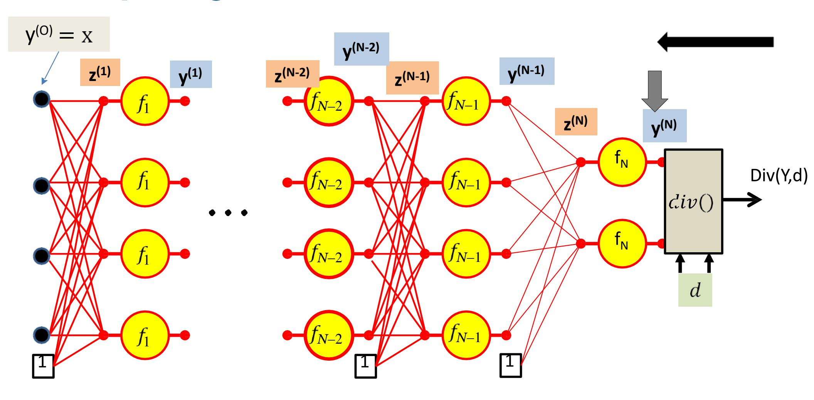

The derivative w.r.t the actual output of the final layer of the network is simply the derivative w.r.t to the output of the network

$$\frac{\partial Div(Y,d)}{\partial y_i^{(N)}} = \frac{\partial Div(Y,d)}{\partial y_i}$$

## **Calculus Refresher: Chain rule**

For any nested function where

$$l = f(y)$$
 where  $y = g(z)$ 

$$\frac{dl}{dz} = \frac{dl}{dy} \frac{dy}{dz}$$

$$\frac{dI}{dz} = \frac{dI}{dy} \frac{dy}{dz}$$

$$z \longrightarrow y \longrightarrow I$$

$$\frac{\partial Div}{\partial z_i^{(N)}} = \frac{\partial y_i^{(N)}}{\partial z_i^{(N)}} \frac{\partial Div}{\partial y_i^{(N)}}$$

$$\frac{\partial Div}{\partial z_i^{(N)}} = f_N' \left( z_i^{(N)} \right) \frac{\partial Div}{\partial y_i^{(N)}}$$

j

j

j

$$\frac{\partial Div}{\partial w_{ij}^{(N)}} = y_i^{(N-1)} \frac{\partial Div}{\partial z_j^{(N)}}$$

$$\frac{\partial Div}{\partial w_{ij}^{(N)}} = y_i^{(N-1)} \frac{\partial Div}{\partial z_j^{(N)}}$$

## **Calculus Refresher: Chain rule**

For 
$$l = f(z_1, z_2, ..., z_M)$$
  
where  $z_i = g_i(x)$ 

$$\frac{dl}{dx} = \frac{\partial l}{\partial z_1} \frac{dz_1}{dx} + \frac{\partial l}{\partial z_2} \frac{dz_2}{dx} + \dots + \frac{\partial l}{\partial z_M} \frac{dz_M}{dx}$$

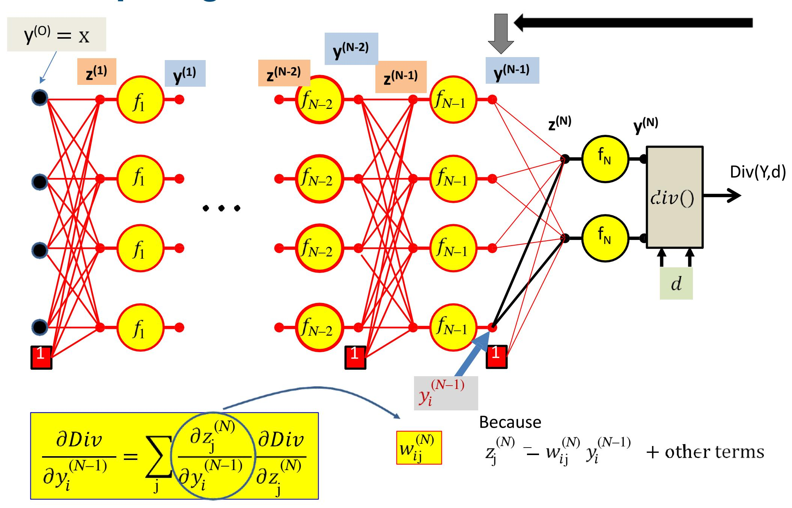

$$\frac{\partial Div}{\partial y_i^{(N-1)}} = \sum_{j} w_{ij}^{(N)} \frac{\partial Div}{\partial z_j^{(N)}}$$

$$\frac{\partial Div}{\partial y_i^{(N-1)}} = \sum_{j} w_{ij}^{(N)} \frac{\partial Div}{\partial z_j^{(N)}}$$

$$\frac{\partial Div}{\partial z_{i}^{(N-1)}} = f_{N-1}^{'} \left( z_{i}^{(N-1)} \right) \frac{\partial Div}{\partial y_{i}^{(N-1)}}$$

$$\frac{\partial Div}{\partial w_{ij}^{(N-1)}} = y_i^{(N-2)} \frac{\partial Div}{\partial z_j^{(N-1)}}$$

For the bias term ( −2) 0

$$\frac{\partial Div}{\partial y_i^{(N-2)}} = \sum_{j} w_{ij}^{(N-1)} \frac{\partial Div}{\partial z_j^{(N-1)}}$$

$$\frac{\partial Div}{\partial z_{i}^{(N-2)}} = f_{N-2}^{'} \left( z_{i}^{(N-2)} \right) \frac{\partial Div}{\partial y_{i}^{(N-2)}}$$

$$\frac{\partial Div}{\partial y_1^{(1)}} = \sum_{j} w_{ij}^{(2)} \frac{\partial Div}{\partial z_j^{(2)}}$$

$$\frac{\partial Div}{\partial z_{i}^{(1)}} = f_{1}^{'} \left( z_{i}^{(1)} \right) \frac{\partial Div}{\partial y_{i}^{(1)}}$$

$$\frac{\partial Div}{\partial w_{ij}^{(1)}} = y_i^{(0)} \frac{\partial Div}{\partial z_j^{(1)}}$$

## **Gradients: Backward Computation**

Initialize: Gradient w.r.t network output

$$\frac{\partial Div}{\partial y_i^{(N)}} = \frac{\partial Div(Y,d)}{\partial y_i}$$

$$\frac{\partial Div}{\partial z_{i}^{(N)}} = f_{k}^{'} \left( z_{i}^{(N)} \right) \frac{\partial Div}{\partial y_{i}^{(N)}}$$

$$\frac{\partial Div}{\partial y_i^{(k)}} = \sum_{j} w_{ij}^{(k+1)} \frac{\partial Div}{\partial z_j^{(k+1)}} \qquad \frac{\partial Div}{\partial z_i^{(k)}} = f_k' \left( z_i^{(k)} \right) \frac{\partial Div}{\partial y_i^{(k)}}$$

$$\forall j \; \frac{\partial Div}{\partial w_{ij}^{(k+1)}} = y_i^{(k)} \; \frac{\partial Div}{\partial z_j^{(k+1)}}$$

#### **Backward Pass**

- Output layer (N):
  - For  $i = 1 ... D_N$ 
    - $\frac{\partial Div}{\partial y_i^{(N)}} = \frac{\partial Div(Y,d)}{\partial y_i}$  [This is the derivative of the divergence]
    - $\frac{\partial Div}{\partial z_i^{(N)}} = \frac{\partial Di}{\partial y_i^{(N)}} f_N' \left( z_i^{(N)} \right)$
    - $\frac{\partial Div}{\partial w_{ij}^{(N)}} = y_i^{(N-1)} \frac{\partial Div}{\partial z_j^{(N)}}$  for  $j = 0 \dots D_{N-1}$
- For layer  $k = N 1 \ downto \ 1$ 
  - For  $i = 1 ... D_k$ 
    - $\frac{\partial Div}{\partial y_i^{(k)}} = \sum_j w_{ij}^{(k+1)} \frac{\partial Div}{\partial z_j^{(k+1)}}$
    - $\frac{\partial Div}{\partial z_i^{(k)}} = \frac{\partial Div}{\partial y_i^{(k)}} f_k' \left( z_i^{(k)} \right)$
    - $\frac{\partial Div}{\partial w_{ij}^{(k)}} = y_i^{(k-1)} \frac{\partial Div}{\partial z_j^{(k)}}$  for  $j = 0 \dots D_{k-1}$

#### **Backward Pass**

- Output layer (N):
  - For  $i = 1 ... D_N$ 
    - $\frac{\partial Div}{\partial y_i^{(N)}} = \frac{\partial Div(Y,d)}{\partial y_i}$
    - $\frac{\partial Div}{\partial z_i^{(N)}} = \frac{\partial Div}{\partial y_i^{(N)}} f_N' \left( z_i^{(N)} \right)$
    - $\frac{\partial Div}{\partial w_{ij}^{(N)}} = y_i^{(N-1)} \frac{\partial Div}{\partial z_i^{(N)}}$  for  $j = 0 \dots D_{N-1}$
- For layer k = N 1 downto 1
  - For  $i = 1 \dots D_k$ 
    - $\frac{\partial Div}{\partial y_i^{(k)}} = \sum_j w_{ij}^{(k+1)} \frac{\partial Div}{\partial z_j^{(k+1)}}$
    - $\frac{\partial Div}{\partial z_i^{(k)}} = \frac{\partial Di}{\partial y_i^{(k)}} f_k' \left( z_i^{(k)} \right)$
    - $\frac{\partial Div}{\partial w_{ij}^{(k)}} = y_i^{(k-1)} \frac{\partial Div}{\partial z_j^{(k)}}$  for  $j = 0 \dots D_{k-1}$

Called "Backpropagation" because the derivative of the loss is propagated "backwards" through the network

Very analogous to the forward pass:

Backward weighted combination of next layer

Backward equivalent of activation

## Using notation $\dot{y} = \frac{\partial Div(Y,d)}{\partial y}$ etc (overdot represents derivative of Div w.r.t variable)

- Output layer (N):
  - For  $i = 1 ... D_N$ 
    - $\dot{y}_i^{(N)} = \frac{\partial Div}{\partial y_i}$
    - $\dot{z}_i^{(N)} = \dot{y}_i^{(N)} f_N' \left( z_i^{(N)} \right)$
    - $\frac{\partial Div}{\partial w_{ii}^{(N)}} = y_j^{(N-1)} \dot{z}_i^{(N)} \text{for } j = 0 \dots D_{N-1}$

Called "Backpropagation" because the derivative of the loss is propagated "backwards" through the network

- For layer k = N 1 downto 1
  - For  $i = 1 ... D_k$ 
    - $\dot{y}_i^{(k)} = \sum_j w_{ij}^{(k+1)} \dot{z}_j^{(k+1)}$
    - $\dot{z}_{i}^{(k)} = \dot{y}_{i}^{(k)} f_{k}'(z_{i}^{(k)})$

•  $\frac{\partial Div}{\partial w_{ii}^{(k)}} = y_j^{(k-1)} \dot{z}_i^{(k)}$  for  $j = 0 \dots D_{k-1}$ 

Very analogous to the forward pass:

Backward weighted combination of next layer

Backward equivalent of activation

#### For comparison: the forward pass again

- Input: D dimensional vector  $\mathbf{x} = [x_j, j = 1 ... D]$
- Set:
  - $-D_0=D$ , is the width of the 0th (input) layer

$$-y_j^{(0)} = x_j, j = 1 \dots D; y_0^{(k=1\dots N)} = x_0 = 1$$

- For layer  $k = 1 \dots N$ 
  - $\operatorname{For} j = 1 \dots D_k$ 
    - $z_j^{(k)} = \sum_{i=0}^{N_k} w_{i,j}^{(k)} y_i^{(k-1)}$ 
      - $y_j^{(k)} = f_k\left(z_j^{(k)}\right)$
- Output:

$$-Y = y_j^{(N)}, j = 1...D_N$$

## **Special cases**

- Have assumed so far that
  - 1. The computation of the output of one neuron does not directly affect computation of other neurons in the same (or previous) layers
  - 2. Inputs to neurons only combine through weighted addition
  - 3. Activations are actually differentiable
  - All of these conditions are frequently not applicable
- Will not discuss all of these in class, but explained in slides
  - Will appear in quiz. Please read the slides

## **Special case 1. Vector activations**

• Vector activations: all outputs are functions of all inputs

## **Special case 1. Vector activations**

Scalar activation: Modifying a only changes corresponding

$$y_i^{(k)} = f\left(z_i^{(k)}\right)$$

Vector activation: Modifying a potentially changes all,

$$\begin{bmatrix} y_1^{(k)} \\ y_2^{(k)} \\ \vdots \\ y_M^{(k)} \end{bmatrix} = f \begin{pmatrix} \begin{bmatrix} z_1^{(k)} \\ z_2^{(k)} \\ \vdots \\ z_D^{(k)} \end{bmatrix} \end{pmatrix}$$

## **"Influence" diagram**

Scalar activation: Each influences *one*

Vector activation: Each influences all,

## **Scalar Activation: Derivative rule**

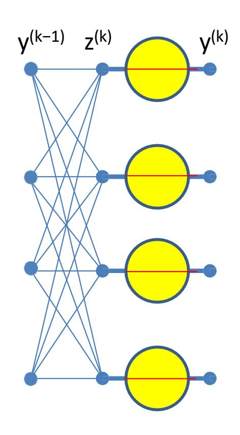

$$\frac{\partial Div}{\partial z_i^{(k)}} = \frac{\partial Div}{\partial y_i^{(k)}} \frac{dy_i^{(k)}}{dz_i^{(k)}}$$

• In the case of *scalar* activation functions, the derivative of the loss w.r.t to the input to the unit is a simple product of derivatives

## **Derivatives of vector activation**

- For *vector* activations the derivative of the loss w.r.t. to any input is a sum of partial derivatives
  - Regardless of the number of outputs

$$y_i^{(k)} = \frac{exp\left(z_i^{(k)}\right)}{\sum_j exp\left(z_j^{(k)}\right)}$$

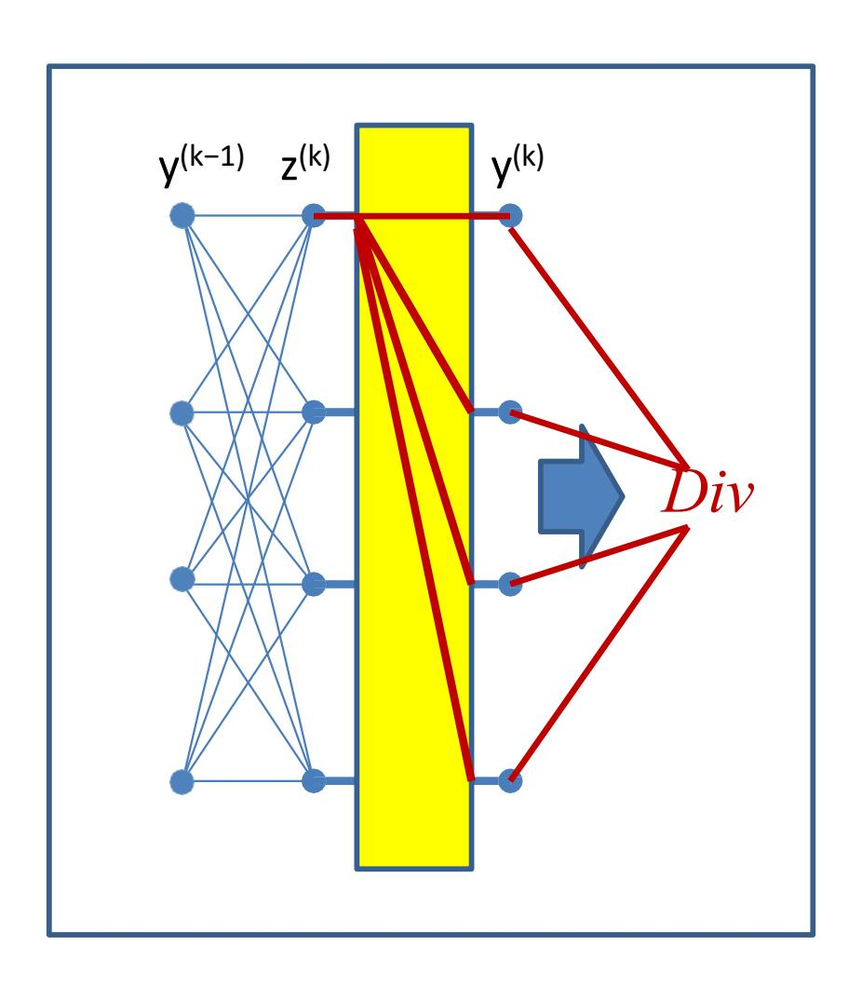

$$y_i^{(k)} = \frac{exp\left(z_i^{(k)}\right)}{\sum_j exp\left(z_j^{(k)}\right)}$$
$$\frac{\partial Div}{\partial x_j} = \sum_j \frac{\partial Div}{\partial x_j} \frac{\partial y_j^{(k)}}{\partial x_j^{(k)}}$$

$$y_i^{(k)} = \frac{exp\left(z_i^{(k)}\right)}{\sum_j exp\left(z_j^{(k)}\right)}$$

$$\frac{\partial Div}{\partial z_i^{(k)}} = \sum_j \frac{\partial Div}{\partial y_j^{(k)}} \frac{\partial y_j^{(k)}}{\partial z_i^{(k)}}$$

$$\frac{\partial y_j^{(k)}}{\partial z_i^{(k)}} = \begin{cases} y_i^{(k)} \left( 1 - y_i^{(k)} \right) & \text{if } i = j \\ -y_i^{(k)} y_j^{(k)} & \text{if } i \neq j \end{cases}$$

$$y_i^{(k)} = \frac{exp\left(z_i^{(k)}\right)}{\sum_j exp\left(z_j^{(k)}\right)}$$

$$\frac{\partial Div}{\partial z_i^{(k)}} = \sum_j \frac{\partial Div}{\partial y_j^{(k)}} \frac{\partial y_j^{(k)}}{\partial z_i^{(k)}}$$

$$\frac{\partial y_j^{(k)}}{\partial z_i^{(k)}} = \begin{cases} y_i^{(k)} \left( 1 - y_i^{(k)} \right) & \text{if } i = j \\ -y_i^{(k)} y_j^{(k)} & \text{if } i \neq j \end{cases}$$

$$\frac{\partial Div}{\partial z_i^{(k)}} = \sum_j \frac{\partial Div}{\partial y_j^{(k)}} y_j^{(k)} \left( \delta_{ij} - y_i^{(k)} \right)$$

- For future reference
- is the Kronecker delta:

#### **Backward Pass for softmax output layer**

- Output layer (N):
  - For  $i = 1 ... D_N$

• 
$$\frac{\partial Div}{\partial y_i^{(N)}} = \frac{\partial Div(Y,d)}{\partial y_i}$$

• 
$$\frac{\partial Div}{\partial z_i^{(N)}} = \sum_j \frac{\partial Div(Y,d)}{\partial y_j^{(N)}} y_i^{(N)} \left( \delta_{ij} - y_j^{(N)} \right)$$

• 
$$\frac{\partial Di}{\partial w_{ij}^{(N)}} = y_i^{(N-1)} \frac{\partial Div}{\partial z_j^{(N)}}$$
 for  $j = 0 \dots D_{N-1}$ 

- For layer k = N 1 downto 1
  - For  $i = 1 ... D_k$

• 
$$\frac{\partial Div}{\partial y_i^{(k)}} = \sum_j w_{ij}^{(k+1)} \frac{\partial Div}{\partial z_j^{(k+1)}}$$

• 
$$\frac{\partial Div}{\partial z_i^{(k)}} = \frac{\partial Div}{\partial y_i^{(k)}} f_k' \left( z_i^{(k)} \right)$$

• 
$$\frac{\partial Div}{\partial w_{ij}^{(k)}} = y_i^{(k-1)} \frac{\partial Div}{\partial z_j^{(k)}}$$
 for  $j = 0 \dots D_{k-1}$ 

## **Special cases**

- Examples of vector activations and other special cases on slides
  - Please look up
  - Will appear in quiz!

## **Vector Activations**

$$\begin{bmatrix} y_1^{(k)} \\ y_2^{(k)} \\ \vdots \\ y_M^{(k)} \end{bmatrix} = f \begin{pmatrix} \begin{bmatrix} z_1^{(k)} \\ z_2^{(k)} \\ \vdots \\ z_D^{(k)} \end{bmatrix} \end{pmatrix}$$

- In reality the vector combinations can be anything
  - E.g. linear combinations, polynomials, logistic (softmax), etc.

## **Special Case 2: Multiplicative networks**

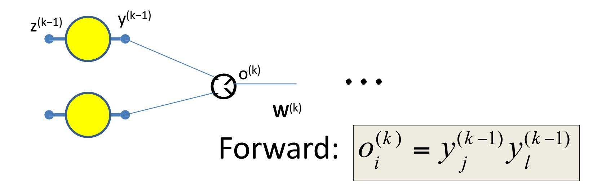

- Some types of networks have *multiplicative* combination
  - In contrast to the *additive* combination we have seen so far
- Seen in networks such as LSTMs, GRUs, attention models, etc.

## **Backpropagation: Multiplicative Networks**

$$o_i^{(k)} = y_j^{(k-1)} y_l^{(k-1)}$$

$$\frac{\partial Div}{\partial o_i^{(k)}} = \sum_j w_{ij}^{(k+1)} \frac{\partial Div}{\partial z_j^{(k+1)}}$$

$$\frac{\partial Div}{\partial y_j^{(k-1)}} = \frac{\partial o_i^{(k)}}{\partial y_j^{(k-1)}} \frac{\partial Div}{\partial o_i^{(k)}} = y_l^{(k-1)} \frac{\partial Div}{\partial o_i^{(k)}}$$

$$\frac{\partial Div}{\partial y_l^{(k-1)}} = y_j^{(k-1)} \frac{\partial Div}{\partial o_i^{(k)}}$$

• Some types of networks have *multiplicative* combination

#### **Multiplicative combination as a case of vector activations**

$$z_i^{(k)} = y_i^{(k-1)}$$

$$y_i^{(k)} = z_{2i-1}^{(k)} z_{2i}^{(k)}$$

• A layer of multiplicative combination is a special case of vector activation

#### **Multiplicative combination: Can be viewed as a case of vector activations**

$$z_i^{(k)} = \sum_j w_{ji}^{(k)} y_j^{(k-1)}$$

$$y_i^{(k)} = \prod_l \left( z_l^{(k)} \right)^{\alpha_{li}^{(k)}}$$

$$\frac{\partial y_{i}^{(k)}}{\partial z_{j}^{(k)}} = \alpha_{ji}^{(k)} \left( z_{j}^{(k)} \right)^{\alpha_{ji}^{(k)} - 1} \prod_{l \neq j} \left( z_{l}^{(k)} \right)^{\alpha_{li}^{(k)}}$$

$$\frac{\partial Div}{\partial z_j^{(k)}} = \sum_i \frac{\partial Div}{\partial y_i^{(k)}} \frac{\partial y_i^{(k)}}{\partial z_j^{(k)}}$$

• A layer of multiplicative combination is a special case of vector activation

## **Gradients: Backward Computation**

For *k = N…1*

For *i = 1:layer width*

If layer has vector activation Else if activation is scalar

$$\frac{\partial Div}{\partial z_i^{(k)}} = \sum_{j} \frac{\partial Div}{\partial y_j^{(k)}} \frac{\partial y_j^{(k)}}{\partial z_i^{(k)}}$$

$$\frac{\partial Div}{\partial y_i^{(k-1)}} = \sum_{j} w_{ij}^{(k)} \frac{\partial Div}{\partial z_j^{(k)}}$$

$$\frac{\partial Div}{\partial z_i^{(k)}} = \frac{\partial Div}{\partial y_i^{(k)}} \frac{\partial y_i^{(k)}}{\partial z_i^{(k)}}$$

$$\frac{\partial Div}{\partial w_{ij}^{(k)}} = y_i^{(k-1)} \frac{\partial Div}{\partial z_j^{(k)}}$$

## **Special Case : Non-differentiable activations**

- Activation functions are sometimes not actually differentiable
  - E.g. The RELU (Rectified Linear Unit)
    - And its variants: leaky RELU, randomized leaky RELU
  - E.g. The "max" function
- Must use "subgradients" where available
  - Or "secants"

## **The subgradient**

$$(f(x) - f(x_0)) \ge v^T(x - x_0)$$

- Any direction such that moving in that direction increasesthe function
- Guaranteed to exist only for convex functions
  - "bowl" shaped functions
  - For non−convex functions, the equivalent concept is a "quasi−secant"
- The subgradient is a direction in which the function is guaranteed to increase
- If the function is differentiable at 0, the subgradient is the gradient
  - The gradient is not alwaysthe subgradient though

#### Non-differentiability: RELU

$$f'(z) = \begin{cases} 0, & z < 0 \\ 1, & z \ge 0 \end{cases}$$

$$\Delta f(z) = \alpha \Delta z$$

- At 0 a *negative* perturbation  $\Delta z < 0$  results in no change of f(z)
  - $-\alpha=0$
- A positive perturbation  $\Delta z > 0$  results in  $\Delta f(z) = \Delta z$ 
  - $-\alpha=1$
- Peering very closely, we can imagine that the curve is rotating continuously from slope = 0 to slope = 1 at z=0
  - So any slope between 0 and 1 is valid

## **Subgradients and the RELU**

- The *subderivative* of a RELU is the slope of any line that lies entirely under it
  - The subgradient is a generalization of the subderivative
  - At the differentiable points on the curve, this is the same as the gradient
- Can use any subgradient at 0
  - Typically, will use the equation given

#### **Subgradients and the Max**

- Vector equivalent of subgradient
  - 1 w.r.t. the largest incoming input
    - · Incremental changes in this input will change the output
  - 0 for the rest
    - Incremental changes to these inputs will not change the output

## **Subgradients and the Max**

$$y_i = \max_{l \in \mathcal{S}_j} z_l$$

$$\frac{\partial y_j}{\partial z_i} = \begin{cases} 1, & i = \underset{l \in \mathcal{S}_j}{\operatorname{argmax}} z_l \\ 0, & otherwise \end{cases}$$

- Multiple outputs, each selecting the max of a different subset of inputs
  - Will be seen in convolutional networks
- Gradient for any output:
  - 1 for the specific component that is maximum in corresponding input subset
  - 0 otherwise

#### **Backward Pass: Recap**

- Output layer (N):
  - For  $i = 1 ... D_N$

• 
$$\frac{\partial Div}{\partial y_i^{(N)}} = \frac{\partial Div(Y,d)}{\partial y_i}$$

• 
$$\frac{\partial Div}{\partial z_i^{(N)}} = \frac{\partial Div}{\partial y_i^{(N)}} \frac{\partial y_i^{(N)}}{\partial z_i^{(N)}}$$
 •  $OR$   $\sum_j \frac{\partial Div}{\partial y_j^{(N)}} \frac{\partial y_j^{(N)}}{\partial z_i^{(N)}}$  (vector activation)

• 
$$\frac{\partial Div}{\partial w_{ji}^{(N)}} = y_j^{(N-1)} \frac{\partial Div}{\partial z_i^{(N)}}$$
 for  $j = 0 \dots D_k$ 

- For layer  $k = N 1 \ downto \ 1$ 
  - For  $i = 1 ... D_k$

• 
$$\frac{\partial Div}{\partial y_i^{(k)}} = \sum_j w_{ij}^{(k+1)} \frac{\partial Div}{\partial z_j^{(k+1)}}$$

• 
$$\frac{\partial Div}{\partial z_i^{(k)}} = \frac{\partial Div}{\partial y_i^{(k)}} \frac{\partial y_i^{(k)}}{\partial z_i^{(k)}}$$
  $OR$   $\sum_j \frac{\partial Div}{\partial y_j^{(k)}} \frac{\partial y_j^{(k)}}{\partial z_i^{(k)}}$  (vector activation)

• 
$$\frac{\partial Div}{\partial w_{ii}^{(k)}} = y_j^{(k-1)} \frac{\partial Div}{\partial z_i^{(k)}}$$
 for  $j = 0 \dots D_k$ 

These may be subgradients

## **Overall Approach**

- For each data instance
  - **Forward pass**: Pass instance forward through the net. Store all intermediate outputs of all computation.
  - **Backward pass**: Sweep backward through the net, iteratively compute all derivatives w.r.t weights
- Actual loss is the sum of the divergence over all training instances

$$\mathbf{Loss} = \frac{1}{|\{X\}|} \sum_{X} Div(Y(X), d(X))$$

• Actual gradient is the sum or average of the derivatives computed for each training instance

$$\nabla_{W} \mathbf{Loss} = \frac{1}{|\{X\}|} \sum_{X} \nabla_{W} Div(Y(X), d(X)) \quad W \leftarrow W - \eta \nabla_{W} \mathbf{Loss}^{\mathsf{T}}$$

#### **Training by BackProp**

- Initialize weights  $W^{(k)}$  for all layers k = 1 ... K
- Do: (Gradient descent iterations)
  - Initialize Loss = 0; For all i, j, k, initialize  $\frac{dLos}{dw_{i,j}^{(k)}} = 0$
  - For all t = 1:T (Iterate over training instances)
    - Forward pass: Compute
      - Output Y,
      - Loss +=  $Div(Y_t, d_t)$
    - Backward pass: For all *i*, *j*, *k*:
      - Compute  $\frac{dDiv(Y_t,d_t)}{dw_{i,j}^{(k)}}$
      - $\frac{dLoss}{dw_{i,j}^{(k)}} += \frac{d\mathbf{Div}(\mathbf{Y}_t, \mathbf{d}_t)}{dw_{i,j}^{(k)}}$
  - For all i, j, k, update:

$$w_{i,j}^{(k)} = w_{i,j}^{(k)} - \frac{\eta}{T} \frac{dLoss}{dw_{i,j}^{(k)}}$$

Until <u>Loss</u> has converged

## **Vector formulation**

- For layered networks it is generally simpler to think of the process in terms of vector operations
  - Simpler arithmetic
  - Fast matrix libraries make operations *much* faster
- We can restate the entire process in vector terms
  - This is what is *actually* used in any real system

## **Vector formulation**

- Arrange the *inputs* to neurons of the kth layer as a vector
- Arrange the outputs of neurons in the kth layer as a vector
- Arrange the weights to any layer as a matrix
  - Similarly with biases

## **Vector formulation**

• The computation of a single layer is easily expressed in matrix notation as (setting ):

$$\mathbf{z}_k = \mathbf{W}_k \, \mathbf{y}_{k-1} + \mathbf{b}_k \qquad \qquad \mathbf{y}_k = \mathbf{f}_k \, (\mathbf{z}_k)$$

## **The forward pass: Evaluating the network**

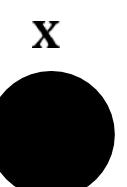

$$\mathbf{y}_1 = f_1 \left( \mathbf{W}_1 \mathbf{x} + \mathbf{b}_1 \right)$$

$$\mathbf{y}_1 = f_1 \left( \mathbf{W}_1 \, \mathbf{x} + \mathbf{b}_1 \right)$$

$$\mathbf{y}_2 = f_2(\mathbf{W}_2 f_1(\mathbf{W}_1 \mathbf{x} + \mathbf{b}_1) + \mathbf{b}_2)$$

$$\mathbf{z}_N = \mathbf{W}_N f_{N-1} (... f_2 (\mathbf{W}_2 f_1 (\mathbf{W}_1 \mathbf{x} + \mathbf{b}_1) + \mathbf{b}_2) ...) + \mathbf{b}_N$$

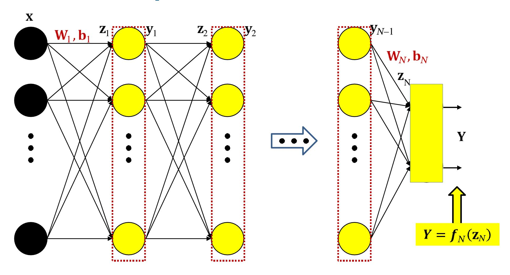

$$Y = f_N(\mathbf{W}_N f_{N-1} (... f_2 (\mathbf{W}_2 f_1 (\mathbf{W}_1 \mathbf{x} + \mathbf{b}_1) + \mathbf{b}_2) ...) + \mathbf{b}_N)$$

## **Forward pass:**

Initialize

$$\mathbf{y}_0 = \mathbf{x}$$

For k = 1 to

$$\mathbf{z}_k = \mathbf{W}_k \mathbf{y}_{k-1} + \mathbf{b}_k$$

$$\mathbf{y}_k = \boldsymbol{f}_k(\mathbf{z}_k)$$

N: Output

$$Y = \mathbf{y}_N$$

- Set
- Iterate through layers:
  - For layer k = 1 to N:

$$\mathbf{z}_k = \mathbf{W}_k \mathbf{y}_{k-1} + \mathbf{b}_k$$
$$\mathbf{y}_k = \mathbf{f}_k(\mathbf{z}_k)$$

• Output:

$$\mathbf{Y} = \mathbf{y}_N$$

## **The Backward Pass**

- Have completed the forward pass
- Before presenting the backward pass, some more calculus…
  - *Vector* calculus this time

## **Vector Calculus Notes 1: Definitions**

- *A derivative is a multiplicative factor that multiplies a perturbation in the input to compute the corresponding perturbation of the output*
- **For a scalar function of a vector argument**

$$y = f(\mathbf{z})$$
$$\Delta y = \nabla_{\mathbf{z}} y \, \Delta \mathbf{z}$$

- If is an vector, is a vector
  - The shape of the derivative is the *transpose* of the shape of
- is called the *gradient* of w.r.t

$$z \xrightarrow{\nabla_z y} y$$
 (influence diagram)

## **Vector Calculus Notes 1: Definitions**

• **For a** *vector* **function of a vector argument**

$$\mathbf{y} = f(\mathbf{z})$$

$$\begin{bmatrix} y_1 \\ y_2 \\ \vdots \\ y_M \end{bmatrix} = f \begin{pmatrix} \begin{bmatrix} z_1 \\ z_2 \\ \vdots \\ z_D \end{bmatrix} \end{pmatrix}$$

$$\Delta y = \nabla_{\mathbf{z}} y \Delta \mathbf{z}$$

- If is an vector, and is an is an matrix
  - Or the dimensions won't match
- is called the *Jacobian* of w.r.t

$$z \xrightarrow{\nabla_z y} y$$

## **Calculus Notes: The Jacobian**

- The derivative of a vector function w.r.t. vector input is called a *Jacobian*
- It is the matrix of partial derivatives given below

$$\begin{bmatrix} y_1 \\ y_2 \\ \vdots \\ y_M \end{bmatrix} = f \begin{pmatrix} \begin{bmatrix} z_1 \\ z_2 \\ \vdots \\ z_D \end{bmatrix} \end{pmatrix}$$

Using vector notation

$$\mathbf{y} = f(\mathbf{z})$$

$$J_{\mathbf{y}}(\mathbf{z}) = \begin{bmatrix} \frac{\partial y_1}{\partial z_1} & \frac{\partial y_1}{\partial z_2} & \dots & \frac{\partial y_1}{\partial z_D} \\ \frac{\partial y_2}{\partial z_1} & \frac{\partial y_2}{\partial z_2} & \dots & \frac{\partial y_2}{\partial z_D} \\ \dots & \dots & \ddots & \dots \\ \frac{\partial y_M}{\partial z_1} & \frac{\partial y_M}{\partial z_2} & \dots & \frac{\partial y_M}{\partial z_D} \end{bmatrix}$$

Check:

$$\Delta \mathbf{y} = J_y(\mathbf{z}) \Delta \mathbf{z}$$

#### **Jacobians can describe the derivatives of neural activations w.r.t their input**

$$y_i = f(z_i)$$

$$J_{\mathbf{y}}(\mathbf{z}) = \begin{bmatrix} f'(z_1) & 0 & \cdots & 0 \\ 0 & f'(z_2) & \cdots & 0 \\ \cdots & \cdots & \ddots & \cdots \\ 0 & 0 & \cdots & f'(z_M) \end{bmatrix}$$

#### • **For scalar activations (shorthand notation):**

- Jacobian is a diagonal matrix
- Diagonal entries are individual derivatives of outputs w.r.t inputs

## **For** *Vector* **activations**

$$J_{\mathbf{y}}(\mathbf{z}) = \begin{bmatrix} \frac{\partial y_1}{\partial z_1} & \frac{\partial y_1}{\partial z_2} & \dots & \frac{\partial y_1}{\partial z_D} \\ \frac{\partial y_2}{\partial z_1} & \frac{\partial y_2}{\partial z_2} & \dots & \frac{\partial y_2}{\partial z_D} \\ \dots & \dots & \ddots & \dots \\ \frac{\partial y_M}{\partial z_1} & \frac{\partial y_M}{\partial z_2} & \dots & \frac{\partial y_M}{\partial z_D} \end{bmatrix}$$

- Jacobian is a full matrix
  - Entries are partial derivatives of individual outputs w.r.t individual inputs

## **Special case: Affine functions**

$$\mathbf{z} = \mathbf{W}\mathbf{y} + \mathbf{b}$$

$$\nabla_{\mathbf{y}}\mathbf{z} = J_{z}(\mathbf{y}) = \mathbf{W}$$

$$\nabla_{\mathbf{b}}\mathbf{z} = J_{z}(\mathbf{b}) = \mathbf{I}$$

- Matrix and bias operating on vector to produce vector
- The Jacobian of w.r.t is simply the matrix

• For nested functions we have the following chain rule

$$\mathbf{y} = y(\mathbf{z}(\mathbf{x}))$$

$$x \xrightarrow{\nabla_{\mathcal{X}} \mathbf{Z}} z \xrightarrow{\nabla_{\mathbf{Z}} \mathbf{y}} y$$

$$\nabla_{x} y = \nabla_{z} y \nabla_{x} z$$

This holds regardless of whether is scalar or vector

• For nested functions we have the following chain rule

$$y = y(z(x))$$

$$\nabla_{x}y = \nabla_{z}y\nabla_{x}z$$

$$\nabla_{z}y \longrightarrow y$$

$$Check$$

$$\Delta y = \nabla_{z}y\Delta z$$

$$\Delta z = \nabla_{x}z\Delta x$$

$$\Delta y = \nabla_{z}y\nabla_{x}z\Delta x$$

- Chain rule for Jacobians:
- **For vector functions of vector inputs:**

$$y = y(z(x))$$

$$J_{\mathbf{y}}(\mathbf{x}) = J_{\mathbf{y}}(\mathbf{z})J_{\mathbf{z}}(\mathbf{x})$$

Check

$$\Delta \mathbf{y} = J_{\mathbf{y}}(\mathbf{z}) \Delta \mathbf{z}$$

$$\Delta z = J_z(\mathbf{x}) \Delta \mathbf{x}$$

$$\Delta \mathbf{y} = J_{\mathbf{y}}(\mathbf{z})J_{\mathbf{z}}(\mathbf{x})\Delta \mathbf{x} = J_{\mathbf{y}}(\mathbf{x})\Delta \mathbf{x}$$

- *Combining Jacobians and Gradients*
- **For** *scalar* **functions of vector inputs ( is vector):**

$$D = D(\mathbf{y}(\mathbf{z})) \qquad \qquad \Gamma_{\mathbf{z}}D = \nabla_{\mathbf{y}}(D)J_{\mathbf{y}}(\mathbf{z})$$

Check

$$\Delta D = \nabla_{\mathbf{y}}(D) \Delta \mathbf{y}$$

$$\Delta y = J_y(\mathbf{z}) \Delta \mathbf{z}$$

$$\Delta D = \nabla_{\mathbf{y}}(D)J_{\mathbf{y}}(\mathbf{z})\Delta\mathbf{z} = \nabla_{\mathbf{z}}D\Delta\mathbf{z}$$

$$x \xrightarrow{\nabla_x \mathbf{z}_1} \mathbf{z}_1 \xrightarrow{\nabla_{\mathbf{z}_1} \mathbf{y}_1} \mathbf{y}_1 \xrightarrow{\nabla_{\mathbf{y}_1} \mathbf{z}_2} \mathbf{z}_2 \xrightarrow{\nabla_{\mathbf{z}_2} \mathbf{y}_2} \mathbf{y}_2 \xrightarrow{\nabla_{\mathbf{y}_2} D} D$$

How do we compute the derivative of *D* w.r.t. *x*, **z**1, *y*1, **z**2 and *y*2, from the local derivatives shown on the edges?

$$x \xrightarrow{\nabla_x z_1} z_1 \xrightarrow{\nabla_{z_1} y_1} y_1 \xrightarrow{\nabla_{y_1} z_2} z_2 \xrightarrow{\nabla_{z_2} y_2} y_2 \xrightarrow{\nabla_{y_2} D} D$$

$$x \xrightarrow{\nabla_{x} \mathbf{z}_{1}} \mathbf{z}_{1} \xrightarrow{\nabla_{\mathbf{z}_{1}} \mathbf{y}_{1}} \mathbf{y}_{1} \xrightarrow{\nabla_{\mathbf{y}_{1}} \mathbf{z}_{2}} \mathbf{z}_{2} \xrightarrow{\nabla_{\mathbf{z}_{2}} \mathbf{y}_{2}} \mathbf{y}_{2} \xrightarrow{\nabla_{\mathbf{y}_{2}} D} \mathbf{z}_{2}$$

$$\nabla_{\mathbf{z}_{2}} D = \nabla_{\mathbf{y}_{2}} D \nabla_{\mathbf{z}_{2}} \mathbf{y}_{2}$$

$$x \xrightarrow{\nabla_{x} \mathbf{z}_{1}} \mathbf{z}_{1} \xrightarrow{\nabla_{z_{1}} \mathbf{y}_{1}} \underbrace{\nabla_{y_{1}} \mathbf{z}_{2}}_{\mathbf{y}_{1}} \underbrace{\nabla_{z_{2}} \mathbf{y}_{2}}_{\mathbf{z}_{2}} \underbrace{\nabla_{z_{2}} \mathbf{y}_{2}}_{\mathbf{y}_{2}} \xrightarrow{\nabla_{y_{2}} D}_{\mathbf{z}_{2}} \mathbf{y}_{2}$$

$$\nabla_{z_{2}} D = \nabla_{y_{2}} D \nabla_{z_{2}} \mathbf{y}_{2}$$

$$\nabla_{y_{1}} \mathbf{z}_{2} \underbrace{\nabla_{z_{2}} D}_{\mathbf{y}_{1}} \mathbf{z}_{2}$$

$$\nabla_{y_{1}} D = \nabla_{z_{2}} D \nabla_{y_{1}} \mathbf{z}_{2}$$

$$\begin{array}{c}
\nabla_{x} \mathbf{z}_{1} & \nabla_{z_{1}} \mathbf{y}_{1} & \nabla_{y_{1}} \mathbf{z}_{2} \\
\mathbf{z}_{1} & \nabla_{z_{1}} \mathbf{y}_{1} & \nabla_{y_{1}} \mathbf{z}_{2}
\end{array}$$

$$\begin{array}{c}
\nabla_{z_{1}} D = \nabla_{z_{2}} D \nabla_{y_{1}} \mathbf{z}_{2}
\end{array}$$

$$\begin{array}{c}
\nabla_{y_{1}} D = \nabla_{z_{2}} D \nabla_{y_{1}} \mathbf{z}_{2}
\end{array}$$

$$\begin{array}{c}
\nabla_{y_{1}} D = \nabla_{y_{1}} D \nabla_{y_{1}} \mathbf{z}_{2}
\end{array}$$

$$\begin{array}{c}
\nabla_{y_{1}} D = \nabla_{y_{1}} D \nabla_{y_{1}} \mathbf{y}_{1}
\end{array}$$

$$\begin{array}{c}
\nabla_{x} \mathbf{Z}_{1} & \nabla_{z_{1}} \mathbf{y}_{1} \\
\mathbf{z}_{1} & \nabla_{z_{1}} \mathbf{y}_{1}
\end{array}$$

$$\begin{array}{c}
\nabla_{y_{1}} \mathbf{z}_{2} \\
\nabla_{z_{2}} \mathbf{D} = \nabla_{y_{2}} \mathbf{D} \nabla_{z_{2}} \mathbf{y}_{2}
\end{array}$$

$$\begin{array}{c}
\nabla_{y_{1}} \mathbf{D} = \nabla_{z_{2}} \mathbf{D} \nabla_{y_{1}} \mathbf{z}_{2}
\end{array}$$

$$\begin{array}{c}
\nabla_{z_{1}} \mathbf{D} = \nabla_{y_{1}} \mathbf{D} \nabla_{z_{1}} \mathbf{y}_{1}
\end{array}$$

$$\begin{array}{c}
\nabla_{x} \mathbf{z}_{1} \mathbf{D} \\
\nabla_{z_{1}} \mathbf{D} = \nabla_{z_{1}} \mathbf{D} \nabla_{z_{1}} \mathbf{z}_{1}
\end{array}$$

$$x \xrightarrow{\nabla_{x} \mathbf{Z}_{1}} \mathbf{Z}_{1} \xrightarrow{\nabla_{\mathbf{Z}_{1}} \mathbf{y}_{1}} \mathbf{y}_{1} \xrightarrow{\nabla_{\mathbf{y}_{1}} \mathbf{Z}_{2}} \mathbf{z}_{2} \xrightarrow{\nabla_{\mathbf{z}_{2}} \mathbf{y}_{2}} \mathbf{y}_{2} \xrightarrow{\nabla_{\mathbf{y}_{2}} D} D$$

$$\nabla_{\mathbf{z}_{2}} D = \nabla_{\mathbf{y}_{2}} D \nabla_{\mathbf{z}_{2}} \mathbf{y}_{2}$$

$$\nabla_{\mathbf{y}_{1}} D = \nabla_{\mathbf{z}_{2}} D \nabla_{\mathbf{y}_{1}} \mathbf{z}_{2}$$

$$\nabla_{\mathbf{z}_{1}} D = \nabla_{\mathbf{y}_{1}} D \nabla_{\mathbf{z}_{1}} \mathbf{y}_{1}$$

$$\nabla_{\mathbf{x}} D = \nabla_{\mathbf{z}_{1}} D \nabla_{\mathbf{x}} \mathbf{z}_{1}$$

• For nested functions we have the following chain rule

$$D = D\left(\mathbf{y}_{N}\left(\mathbf{z}_{N}\left(\mathbf{y}_{N-1}\left(\mathbf{z}_{N-1}\left(\ldots\mathbf{y}_{1}\left(\mathbf{z}_{1}(\mathbf{x})\right)\right)\right)\right)\right)\right)$$

$$\nabla_{\mathbf{x}}D = \nabla_{\mathbf{y}_N}D\nabla_{\mathbf{z}_N}\mathbf{y}_N\nabla_{\mathbf{y}_{N-1}}\mathbf{z}_N\nabla_{\mathbf{z}_{N-1}}\mathbf{y}_{N-1}...\nabla_{\mathbf{z}_1}\mathbf{y}_1\nabla_{\mathbf{x}}\mathbf{z}_1$$

• For nested functions we have the following chain rule

$$D = D\left(y_N \left(z_N \left(y_{N-1} \left(z_{N-1} \left(... y_1 \left(z_1(x)\right)\right)\right)\right)\right)\right)$$

$$\nabla_{\mathbf{x}}D = \nabla_{\mathbf{y}_N}D\nabla_{\mathbf{z}_N}\mathbf{y}_N\nabla_{\mathbf{y}_{N-1}}\mathbf{z}_N\nabla_{\mathbf{z}_{N-1}}\mathbf{y}_{N-1}...\nabla_{\mathbf{z}_1}\mathbf{y}_1\nabla_{\mathbf{x}}\mathbf{z}_1$$

• Scalar functions of Affine functions

$$\mathbf{z} = \mathbf{W}\mathbf{y} + \mathbf{b}$$
$$D = f(\mathbf{z})$$

$$y \xrightarrow{W} z \xrightarrow{\nabla_z D} D$$

$$\Gamma_y D = \nabla_z D W$$

• Scalar functions of Affine functions

$$z = Wy + b$$

$$D = f(\mathbf{z})$$

$$y \xrightarrow{W} z \xrightarrow{\nabla_z D} D$$

$$\Gamma_v D = \nabla_z D W$$

$$abla_{\mathbf{b}}D = \nabla_{\mathbf{z}}D\nabla_{\mathbf{b}}\mathbf{z} = \nabla_{\mathbf{z}}D
abla_{\mathbf{b}}$$

• Scalar functions of Affine functions

$$z = Wy + b$$

$$D = f(\mathbf{z})$$

$$abla_{\mathbf{b}}D = \nabla_{\mathbf{z}}D$$

$$\nabla_{\mathbf{W}}D = \mathbf{y}\nabla_{\mathbf{z}}D$$

• Scalar functions of Affine functions

$$z = Wy + b$$

$$D = f(\mathbf{z})$$

$$\Gamma_{\mathbf{y}}D = \nabla_{\mathbf{z}}(D)\mathbf{W}$$

$$\Gamma_{\mathbf{b}}D = \nabla_{\mathbf{z}}(D)$$

$$\nabla_{\mathbf{W}}D = \mathbf{y}\nabla_{\mathbf{z}}(D)$$

Derivatives w.r.t parameters

• Note: the derivative shapes are the *transpose* of the shapes of and

• Scalar functions of Affine functions

$$\mathbf{z} = \mathbf{W}\mathbf{y} + \mathbf{b} \qquad D = f(\mathbf{z})$$

• Writing the transpose

$$\mathbf{z}^{\mathsf{T}} = \mathbf{y}^{\mathsf{T}} \mathbf{W}^{\mathsf{T}} + \mathbf{b}^{\mathsf{T}}$$
$$\nabla_{\mathbf{w}^{\mathsf{T}}} \mathbf{z}^{\mathsf{T}} = \mathbf{v}^{\mathsf{T}}$$

$$\nabla_{\boldsymbol{W}^{\top}}D = \nabla_{\boldsymbol{z}^{\top}}D \ \nabla_{\boldsymbol{W}^{\top}}\boldsymbol{z}^{\top} = \nabla_{\boldsymbol{z}^{\top}}D \ \boldsymbol{y}^{\top}$$

$$\nabla_{\boldsymbol{W}}D = (\nabla_{\boldsymbol{W}^{\top}}D)^{\top} = \mathbf{y}\nabla_{\mathbf{z}}D$$

$$\nabla_{\mathbf{W}}D = \mathbf{y}\nabla_{\mathbf{z}}(D)$$

## **Special Case: Application to a network**

• Scalar functions of Affine functions

$$z = Wy + b$$

$$Div = Div(\mathbf{z})$$

$$\Gamma_{\mathbf{y}}Div = \nabla_{\mathbf{z}}Div\mathbf{W}$$

$$\mathbf{z}_k = \mathbf{W}_k \mathbf{y}_{k-1} + \mathbf{b}_k$$

The divergence is a scalar function of Applying the above rule

$$\Gamma_{\mathbf{y}_{k-1}}Div = \nabla_{\mathbf{z}_k}Div\mathbf{W}_k$$

## Special Case: Application to a network

Scalar functions of Affine functions

$$z = Wy + b$$

$$Div = Div(\mathbf{z})$$

$$\Gamma_{\mathbf{b}}Div = \nabla_{\mathbf{z}}Div$$

$$\Gamma_{\mathbf{b}}Div = \nabla_{\mathbf{z}}Div$$

$$\nabla_{\mathbf{W}}Div = \mathbf{y}\nabla_{\mathbf{z}}Div$$

$$\mathbf{z}_k = \mathbf{W}_k \mathbf{y}_{k-1} + \mathbf{b}_k$$

$$\Gamma_{\mathbf{b}_k} Div = \nabla_{\mathbf{z}_k} Div$$

$$\nabla_{\mathbf{W}_k} D = \mathbf{y}_{k-1} \Gamma_{\mathbf{z}_k} Div$$

The network again

• The network again (with variables shown)…

- The network again (with variables shown)…
- With the divergence we will minimize…

• The network is a nested function

$$Y = f_N(\mathbf{W}_N f_{N-1} (... f_2(\mathbf{W}_2 f_1(\mathbf{W}_1 \mathbf{x} + \mathbf{b}_1) + \mathbf{b}_2) ...) + \mathbf{b}_N)$$

• The divergence for any is also a nested function

$$Div(Y,d) = Div(f_N(\mathbf{W}_N f_{N-1} (... f_2(\mathbf{W}_2 f_1(\mathbf{W}_1 \mathbf{x} + \mathbf{b}_1) + \mathbf{b}_2) ...) + \mathbf{b}_N), d)$$

- The network again (with variables shown)…
- With the divergence we will minimize…
- And the entire influence diagram

In the following slides we will also be using the notation z to represent the derivative of any w.r.t any

Note that for activation functions, these are actually Jacobians

- The network again (with variables shown)…
- With the divergence we will minimize…
- And the entire influence diagram (with derivatives)
  - Variable subscripts notshown in for brevity

• The network again (with variables shown)...

These are Jacobians

- With the divergence we will minimize...
- And the entire influence diagram (with derivatives)
  - Variable subscripts not shown in  $\nabla_z y$  for brevity

• The network again (with variables shown)...

What are these?

- With the divergence we will minimize...
- And the entire influence diagram (with derivatives)
  - Variable subscripts not shown in  $\nabla_z y$  for brevity

- The network again (with variables shown)…
- With the divergence we will minimize…
- And the entire influence diagram (with derivatives)
  - Variable subscripts notshown in for brevity

First compute the derivative of the divergence w.r.t. . The actual derivative depends on the divergence function.

N.B: The gradient is the transpose of the derivative

$$\nabla_{\mathbf{z}^N} Div = \nabla_{\mathbf{Y}} Div \cdot \nabla_{\mathbf{z}^N} \mathbf{Y}$$

Already computed New term

Already computed Jacobian

z is just the Jacobian of the activation function

$$\nabla_{\mathbf{v}^{N-1}} Div = \nabla_{\mathbf{z}^N} Div \mathbf{W}_N$$

$$\mathbf{z}_N = \mathbf{W}_N \mathbf{y}_{N-1} + \mathbf{b}_N \quad \Rightarrow \quad \nabla_{\mathbf{y}_{N-1}} \mathbf{z}_N = \mathbf{W}_N$$

$$\nabla_{\mathbf{v}^{N-1}} Div = \nabla_{\mathbf{z}^N} Div \mathbf{W}_N$$

Already computed New term

$$\mathbf{z}_N = \mathbf{W}_N \mathbf{y}_{N-1} + \mathbf{b}_N \quad \Rightarrow \quad \nabla_{\mathbf{y}_{N-1}} \mathbf{z}_N = \mathbf{W}_N$$

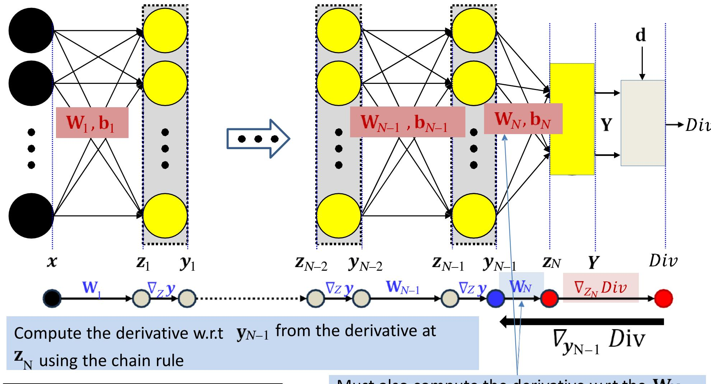

$$\nabla_{\mathbf{y}_{N-1}} Div = \nabla_{\mathbf{z}_N} Div \mathbf{W}_N$$

Already computed New term

−1 y −1

Must also compute the derivative w.r.t the −1 and using the rule for affine transforms

$$\nabla_{\mathbf{y}_{N-1}} Div = \nabla_{\mathbf{z}_N} Div \mathbf{W}_N$$

Affine parameter rules

$$\nabla_{\mathbf{z}^{N-1}} Div = \nabla_{\mathbf{y}^{N-1}} Div \cdot \nabla_{\mathbf{z}^{N-1}} \mathbf{y}_{N-1}$$

Already computed New term

N−1 using the chain rule

$$\nabla_{\mathbf{z}_{N-1}} Div = \nabla_{\mathbf{y}_{N-1}} Div.J_{\mathbf{y}_{N-1}} (\mathbf{z}_{N-1})$$

Already computed Jacobian

z −1 N−1 is the Jacobian of the activation function. It is a diagonal matrix for scalar activations

We now have the derivative for N−1

Already computed New

$$\nabla_{\mathbf{z}_1} Div = \nabla_{\mathbf{y}_1} Div J_{\mathbf{y}_1} (\mathbf{z}_1)$$

$$\nabla_{\mathbf{v}_N} Div = \nabla_Y Div$$

Initialize: For k = N downto 1:

$$\nabla_{\mathbf{z}_k} Div = \nabla_{\mathbf{y}_k} Div J_{\mathbf{y}_k}(\mathbf{z}_k)$$

$$\nabla_{\mathbf{y}_{k-1}} Div = \nabla_{\mathbf{z}_k} Div \, \mathbf{W}_k$$

$$\nabla_{\mathbf{b}_k} Div = \nabla_{\mathbf{z}_k} Div$$

$$\nabla_{\mathbf{W}_k} Div = \mathbf{y}_{k-1} \nabla_{\mathbf{z}_k} Div$$

- , Set
- Initialize: Compute
- For layer k = N downto 1:
  - Compute
    - Will require intermediate values computed in the forward pass
  - Backward recursion step:

$$\nabla_{\mathbf{z}_{k}} Div = \nabla_{\mathbf{y}_{k}} Div J_{\mathbf{y}_{k}} (\mathbf{z}_{k})$$

$$\nabla_{\mathbf{y}_{k-1}} Div = \nabla_{\mathbf{z}_{k}} Div \mathbf{W}_{k}$$

– Gradient computation:

$$abla_{\mathbf{W}_k} Div = \mathbf{y}_{k-1} \nabla_{\mathbf{z}_k} Div 
abla_{\mathbf{b}_k} Div = \nabla_{\mathbf{z}_k} Div$$

- , Set
- Initialize: Compute
- For layer k = N downto 1:
  - Compute
    - Will require intermediate values computed in the forward pass
  - Backward recursion step: Note analogy to forward pass

$$abla_{\mathbf{z}_k} Div = 
abla_{\mathbf{y}_k} Div J_{\mathbf{y}_k} (\mathbf{z}_k) 
abla_{\mathbf{y}_{k-1}} Div = 
abla_{\mathbf{z}_k} Div \mathbf{W}_k
abla_k
abla_k
abla_k Div \mathbf{W}_k
abla_k Div \mathbf{W}_k
abla_k Div \mathbf{W}_k
abla_k Div \mathbf{W}_k
abla_k Div \mathbf{W}_k
abla_k Div \mathbf{W}_k
abla_k Div \mathbf{W}_k
abla_k Div \mathbf{W}_k
abla_k Div \mathbf{W}_k
abla_k Div \mathbf{W}_k
abla_k Div \mathbf{W}_k
abla_k Div \mathbf{W}_k
abla_k Div \mathbf{W}_k
abla_k Div \mathbf{W}_k
abla_k Div \mathbf{W}_k
abla_k Div \mathbf{W}_k
abla_k Div \mathbf{W}_k
abla_k Div \mathbf{W}_k
abla_k Div \mathbf{W}_k
abla_k Div \mathbf{W}_k
abla_k Div \mathbf{W}_k
abla_k Div \mathbf{W}_k
abla_k Div \mathbf{W}_k
abla_k Div \mathbf{W}_k
abla_k Div \mathbf{W}_k
abla_k Div \mathbf{W}_k
abla_k Div \mathbf{W}_k
abla_k Div \mathbf{W}_k
abla_k Div \mathbf{W}_k
abla_k Div \mathbf{W}_k
abla_k Div \mathbf{W}_k
abla_k Div \mathbf{W}_k
abla_k Div \mathbf{W}_k
abla_k Div \mathbf{W}_k
abla_k Div \mathbf{W}_k
abla_k Div \mathbf{W}_k
abla_k Div \mathbf{W}_k
abla_k Div \mathbf{W}_k
abla_k Div \mathbf{W}_k
abla_k Div \mathbf{W}_k
abla_k Div \mathbf{W}_k
abla_k Div \mathbf{W}_k
abla_k Div \mathbf{W}_k
abla_k Div \mathbf{W}_k
abla_k Div \mathbf{W}_k
abla_k Div \mathbf{W}_k
abla_k Div \mathbf{W}_k
abla_k Div \mathbf{W}_k
abla_k Div \mathbf{W}_k
abla_k Div \mathbf{W}_k
abla_k Div \mathbf{W}_k
abla_k Div \mathbf{W}_k
abla_k Div \mathbf{W}_k
abla_k Div \mathbf{W}_k
abla_k Div \mathbf{W}_k
abla_k Div \mathbf{W}_k
abla_k Div \mathbf{W}_k
abla_k Div \mathbf{W}_k
abla_k Div \mathbf{W}_k
abla_k Div \mathbf{W}_k
abla_k Div \mathbf{W}_k
abla_k Div \mathbf{W}_k
abla_k Div \mathbf{W}_k
abla_k Div \mathbf{W}_k
abla_k Div \mathbf{W}_k
abla_k Div \mathbf{W}_k
abla_k Div \mathbf{W}_k
abla_k Div \mathbf{W}_k
abla_k Div \mathbf{W}_k
abla_k Div \mathbf{W}_k
abla_k Div \mathbf{W}_k
abla_k Div \mathbf{W}_k
abla_k Div \mathbf{W}_k
abla_k Div \mathbf{W}_k
abla_k Div \mathbf{W}_k
abla_k Div \mathbf{W}_k
abla_k Div \mathbf{W}_k
abla_k Div \mathbf{W}_k
abla_k Div \mathbf{W}_k
abla_k Div \mathbf{W}_k
abla_k Div \mathbf{W}_k
abla_k Div \mathbf{W}_k
abla_k Div \mathbf{W}_k
abla_k Div \mathbf{W}_k
abla_k Div \mathbf{W}_k
abla_k Div \mathbf{W}_k
abla_k Div \mathbf{W}_k
abla_k Div \mathbf{W}_k
abla_k Div \mathbf{W}_k
abla_k Div \mathbf{W}_k
abla_k Div \mathbf{W}_k
abla_k Div \mathbf{W}_k
abla_k Div \mathbf{W}_k
abla_k Div \mathbf{W}_k
abla_k Div \mathbf{W}_k
abla_k Div \mathbf{W}_k
abla_k Div \mathbf{W}_k
abla_k Div \mathbf{W}_k
abla_k Div \mathbf{W}_k
abla_k Div \mathbf{W}_k
abla_k Div \mathbf{W}_k
abla_k Div \mathbf{W}_k
abla_k Div \mathbf{W}_k
abla_k Div \mathbf{W}_k
abla_k Div \mathbf{W}_k
abla_k Div \mathbf{W}_k
abla_k Div$$

– Gradient computation:

$$egin{aligned} 
abla_{\mathbf{W}_k} Div &= \mathbf{y}_{k-1} 
abla_{\mathbf{z}_k} Div \ 
abla_{\mathbf{b}_k} Div &= 
abla_{\mathbf{z}_k} Div \end{aligned}$$

## **For comparison: The Forward Pass**

- Set
- For layer k = 1 to N :
  - Forward recursion step:

$$\mathbf{z}_k = \mathbf{W}_k \mathbf{y}_{k-1} + \mathbf{b}_k$$
$$\mathbf{y}_k = \mathbf{f}_k(\mathbf{z}_k)$$

• Output:

$$\mathbf{Y} = \mathbf{y}_N$$

## **Neural network training algorithm**

- Initialize all weights and biases 1 1 2 2
- Do:
  - –
  - W b For all , initialize ,
  - For all # Loop through training instances
    - Forward pass : Compute
      - Output (X )
      - Divergence ( , )
      - += ( , )
    - Backward pass: For all compute:
  - For all

$$\mathbf{W}_{k} = \mathbf{W}_{k} - \frac{\eta}{T} (\nabla_{\mathbf{W}_{k}} Loss)^{T}; \qquad \mathbf{b}_{k} = \mathbf{b}_{k} - \frac{\eta}{T} (\nabla_{\mathbf{W}_{k}} Loss)^{T}$$

• Until has converged

## **Setting up for digit recognition**

Training data

- Simple Problem: Recognizing "2" or "not 2"
- Single output with sigmoid activation
  - ∈ (0,1)
  - ℎ 0 1
- Use KL divergence
- Backpropagation to compute derivatives
  - To apply in gradient descent to learn network parameters

## **Recognizing the digit**

Training data

$$(5,5)$$
  $(2,2)$   $(2,2)$   $(2,2)$   $(2,0)$   $(2,2)$ 

- More complex problem: Recognizing digit
- Network with 10 (or 11) outputs
  - First ten outputs correspond to the ten digits
    - Optional 11th is for none of the above
- Softmax output layer:
  - Ideal output: One of the outputs goes to 1, the others go to 0
- Backpropagation with KL divergence
  - To compute derivatives for gradient descent updates to learn network